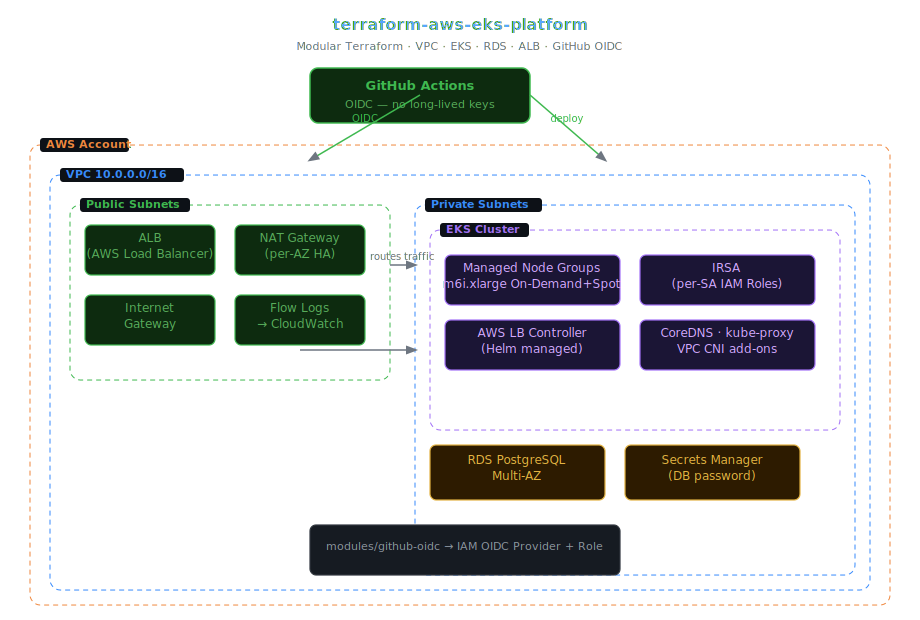

# terraform-aws-eks-platform

> Production-ready modular Terraform library for a complete AWS EKS platform. Each module is independently usable; `examples/complete` wires all of them into a full working cluster end-to-end.

[](https://github.com/ashiq-ali/terraform-aws-eks-platform/actions)
[](LICENSE)
[](https://terraform.io)
[](https://aws.amazon.com)

---

## Architecture



> 📐 **[Edit in Excalidraw](docs/architecture.excalidraw)** — open the `.excalidraw` file at [excalidraw.com](https://excalidraw.com) to edit interactively.

```
┌─────────────────────────────────────────────────────────────────────────────────┐
│  GitHub Actions  ──OIDC──►  AWS IAM (no long-lived keys)                       │
└─────────────────────────────────────────────────────────────────────────────────┘
                                        │
┌── AWS Account ─────────────────────────────────────────────────────────────────┐
│ ┌── VPC  10.0.0.0/16 ───────────────────────────────────────────────────────┐  │
│ │                                                                            │  │
│ │  ┌─ Public Subnets ──────────────────┐  ┌─ Private Subnets ─────────────┐ │  │
│ │  │  ALB (AWS Load Balancer)          │  │  ┌─ EKS Cluster ────────────┐ │ │  │
│ │  │  NAT Gateway (per-AZ)             │  │  │  Managed Node Groups     │ │ │  │
│ │  │  Internet Gateway                 │  │  │  IRSA (per-SA IAM roles) │ │ │  │
│ │  └───────────────────────────────────┘  │  │  aws-load-balancer-ctrl  │ │ │  │
│ │                                         │  └──────────────────────────┘ │ │  │
│ │                                         │  RDS PostgreSQL (Multi-AZ)    │ │  │
│ │                                         │  Secrets Manager              │ │  │
│ │                                         └───────────────────────────────┘ │  │
│ └────────────────────────────────────────────────────────────────────────────┘  │
└────────────────────────────────────────────────────────────────────────────────┘
```

---

## Table of Contents

- [Why this exists](#why-this-exists)
- [Modules](#modules)
- [Prerequisites](#prerequisites)
- [Quick Start](#quick-start)
- [Module Reference](#module-reference)
  - [vpc](#vpc-module)
  - [eks](#eks-module)
  - [rds](#rds-module)
  - [alb](#alb-module)
  - [github-oidc](#github-oidc-module)
- [Complete Example](#complete-example)
- [IRSA — IAM Roles for Service Accounts](#irsa)
- [GitHub Actions CI/CD](#github-actions-cicd)
- [Cost Estimate](#cost-estimate)
- [Security Considerations](#security-considerations)
- [Troubleshooting](#troubleshooting)

---

## Why this exists

Most "EKS Terraform" repos either dump everything into a single `main.tf` or rely entirely on the `terraform-aws-modules/eks` super-module that hides all the wiring. This library takes the middle path:

- **Independently usable modules** — bring only what you need
- **No long-lived IAM credentials** — GitHub OIDC federation is a first-class module
- **IRSA baked in** — every workload gets its own scoped IAM role, not a shared node profile
- **Production defaults** — Multi-AZ RDS, per-AZ NAT Gateways, SSD-backed nodes, encryption at rest

---

## Modules

| Module | What it creates | Key resources |
|--------|----------------|---------------|
| `modules/vpc` | Networking foundation | VPC, public/private subnets, NAT GWs, flow logs |
| `modules/eks` | Kubernetes control plane + workers | EKS cluster, managed node groups, IRSA bootstrap |
| `modules/rds` | Managed PostgreSQL | RDS Multi-AZ, parameter group, Secrets Manager secret |
| `modules/alb` | Ingress layer | AWS Load Balancer Controller, IngressClass |
| `modules/github-oidc` | Keyless CI/CD | IAM OIDC provider, role + policy for GitHub Actions |

---

## Prerequisites

| Tool | Version | Install |
|------|---------|---------|
| Terraform | ≥ 1.5 | `brew install terraform` |
| AWS CLI | ≥ 2.x | `brew install awscli` |
| kubectl | ≥ 1.28 | `brew install kubectl` |
| helm | ≥ 3.x | `brew install helm` |
| AWS account | — | Admin or PowerUser IAM access |

---

## Quick Start

```bash
# 1. Clone
git clone https://github.com/ashiq-ali/terraform-aws-eks-platform
cd terraform-aws-eks-platform/examples/complete

# 2. Configure
cp terraform.tfvars.example terraform.tfvars
# Edit terraform.tfvars — set project_name, aws_region, db_password

# 3. Deploy
terraform init
terraform plan
terraform apply

# 4. Connect kubectl
aws eks update-kubeconfig \
  --name $(terraform output -raw cluster_name) \
  --region $(terraform output -raw aws_region)

kubectl get nodes
```

> **First apply takes ~15 minutes** — EKS control plane provisioning is the long pole.

---

## Module Reference

### VPC Module

```hcl
module "vpc" {
  source = "github.com/ashiq-ali/terraform-aws-eks-platform//modules/vpc"

  name               = "my-eks"
  cidr               = "10.0.0.0/16"
  availability_zones = ["eu-west-2a", "eu-west-2b", "eu-west-2c"]

  # Subnet CIDRs auto-calculated from the VPC CIDR
  # Public:  10.0.0.0/24, 10.0.1.0/24, 10.0.2.0/24
  # Private: 10.0.10.0/23, 10.0.12.0/23, 10.0.14.0/23
}
```

| Input | Default | Description |
|-------|---------|-------------|
| `name` | required | Resource name prefix |
| `cidr` | `"10.0.0.0/16"` | VPC CIDR block |
| `availability_zones` | required | List of AZs (min 2 for HA) |
| `enable_flow_logs` | `true` | Send VPC flow logs to CloudWatch |
| `single_nat_gateway` | `false` | `true` = one NAT GW (saves cost in dev) |

Outputs: `vpc_id`, `private_subnet_ids`, `public_subnet_ids`, `nat_gateway_ips`

---

### EKS Module

```hcl
module "eks" {
  source = "github.com/ashiq-ali/terraform-aws-eks-platform//modules/eks"

  cluster_name       = "production"
  kubernetes_version = "1.29"
  vpc_id             = module.vpc.vpc_id
  subnet_ids         = module.vpc.private_subnet_ids

  node_groups = {
    general = {
      instance_types = ["m6i.xlarge"]
      min_size       = 2
      max_size       = 10
      desired_size   = 3
    }
    spot = {
      instance_types = ["m6i.xlarge", "m6a.xlarge", "m5.xlarge"]
      capacity_type  = "SPOT"
      min_size       = 0
      max_size       = 20
      desired_size   = 5
    }
  }
}
```

| Input | Default | Description |
|-------|---------|-------------|
| `cluster_name` | required | EKS cluster name |
| `kubernetes_version` | `"1.29"` | K8s version |
| `node_groups` | see above | Map of managed node group configs |
| `enable_irsa` | `true` | Create OIDC provider for IRSA |
| `cluster_endpoint_private_access` | `true` | Private API endpoint |
| `cluster_endpoint_public_access` | `true` | Public API endpoint (restrict with `public_access_cidrs`) |

Outputs: `cluster_name`, `cluster_endpoint`, `oidc_provider_arn`, `cluster_certificate_authority_data`

---

### RDS Module

```hcl
module "rds" {
  source = "github.com/ashiq-ali/terraform-aws-eks-platform//modules/rds"

  identifier        = "myapp-db"
  engine_version    = "15.4"
  instance_class    = "db.t4g.medium"
  allocated_storage = 100

  vpc_id             = module.vpc.vpc_id
  subnet_ids         = module.vpc.private_subnet_ids
  allowed_cidr_blocks = [module.vpc.vpc_cidr]

  # Password stored in Secrets Manager automatically
  # Reference it in pods via ExternalSecret or SSM Parameter Store
}
```

The module creates a Secrets Manager secret at `/${identifier}/master-password` with JSON:
```json
{"username": "postgres", "password": "<generated>", "host": "<endpoint>", "port": 5432}
```

---

### ALB Module

Installs the [AWS Load Balancer Controller](https://kubernetes-sigs.github.io/aws-load-balancer-controller/) via Helm and creates the `alb` IngressClass:

```hcl
module "alb" {
  source = "github.com/ashiq-ali/terraform-aws-eks-platform//modules/alb"

  cluster_name     = module.eks.cluster_name
  oidc_provider_arn = module.eks.oidc_provider_arn
  vpc_id           = module.vpc.vpc_id
}
```

After apply, create Ingress resources with `ingressClassName: alb` and the controller provisions ALBs automatically.

---

### GitHub OIDC Module

Eliminates long-lived AWS access keys in CI/CD:

```hcl
module "github_oidc" {
  source = "github.com/ashiq-ali/terraform-aws-eks-platform//modules/github-oidc"

  github_org  = "ashiq-ali"
  github_repo = "my-app"

  # IAM policy the GitHub Actions role can assume
  policy_arns = ["arn:aws:iam::aws:policy/AmazonEKSClusterPolicy"]
}
```

In your GitHub Actions workflow:
```yaml
permissions:
  id-token: write
  contents: read

steps:
  - uses: aws-actions/configure-aws-credentials@v4
    with:
      role-to-assume: ${{ secrets.AWS_ROLE_ARN }}
      aws-region: eu-west-2
```

---

## Complete Example

The `examples/complete` directory deploys a fully wired platform:

```
examples/complete/
├── main.tf          # Wires all 5 modules together
├── variables.tf     # project_name, aws_region, db_password
├── outputs.tf       # cluster_name, db_endpoint, alb_dns
└── terraform.tfvars.example
```

```bash
cd examples/complete
cp terraform.tfvars.example terraform.tfvars
# Fill in: project_name, aws_region, db_password_secret_name
terraform init && terraform apply
```

---

## IRSA

IRSA lets pods assume IAM roles without node-level credentials. After the EKS module creates the OIDC provider:

```hcl
# Create an IAM role for a specific service account
resource "aws_iam_role" "s3_reader" {
  name = "my-app-s3-reader"

  assume_role_policy = jsonencode({
    Version = "2012-10-17"
    Statement = [{
      Effect    = "Allow"
      Principal = { Federated = module.eks.oidc_provider_arn }
      Action    = "sts:AssumeRoleWithWebIdentity"
      Condition = {
        StringEquals = {
          "${module.eks.oidc_issuer_url}:sub" = "system:serviceaccount:default:my-app"
        }
      }
    }]
  })
}
```

Annotate the Kubernetes ServiceAccount:
```yaml
apiVersion: v1
kind: ServiceAccount
metadata:
  name: my-app
  annotations:
    eks.amazonaws.com/role-arn: arn:aws:iam::ACCOUNT:role/my-app-s3-reader
```

---

## GitHub Actions CI/CD

The included workflow runs on every PR and push to `main`:

```yaml
# .github/workflows/terraform-ci.yml
jobs:
  validate:
    - terraform fmt -check -recursive
    - terraform init -backend=false
    - terraform validate
    - tflint --recursive
```

For `apply`, configure the GitHub OIDC module and add a `terraform apply` step with appropriate branch protection.

---

## Cost Estimate

Approximate monthly costs for `examples/complete` with defaults (eu-west-2):

| Resource | Spec | ~Cost/month |
|----------|------|-------------|
| EKS control plane | — | $73 |
| EC2 nodes | 3× m6i.xlarge On-Demand | $420 |
| EC2 nodes (Spot pool) | 5× mixed, avg 70% discount | $180 |
| RDS PostgreSQL | db.t4g.medium Multi-AZ | $95 |
| NAT Gateways | 3× (one per AZ) | $100 |
| ALB | per LCU | ~$20 |
| **Total** | | **~$888/month** |

**Dev cost** (single NAT GW, `db.t3.micro` single-AZ, 2 On-Demand nodes): ~$250/month

---

## Security Considerations

- **No privileged node roles** — all AWS access via IRSA
- **Private API endpoint** — control plane not exposed to internet by default
- **Encrypted storage** — EBS volumes and RDS encrypted with AWS-managed KMS keys
- **Secrets in Secrets Manager** — DB password never in Terraform state in plaintext
- **VPC flow logs** — enabled by default, shipped to CloudWatch Logs
- **Security groups** — principle of least privilege; nodes cannot talk to each other by default

---

## Troubleshooting

**`Error: the Kubernetes cluster could not be reached` during apply**

The EKS cluster endpoint must be reachable from where Terraform runs. If running locally with a private endpoint only, add your IP to `public_access_cidrs` temporarily.

**Node group stuck in `DEGRADED`**

Check instance type availability in your chosen AZs:
```bash
aws ec2 describe-instance-type-offerings \
  --location-type availability-zone \
  --filters "Name=instance-type,Values=m6i.xlarge" \
  --query 'InstanceTypeOfferings[].Location'
```

**`AccessDenied` from pod to AWS service**

Verify the ServiceAccount has the IRSA annotation and the IAM role trust policy matches the namespace + SA name exactly.

**ALB not provisioned after Ingress creation**

```bash
kubectl logs -n kube-system deployment/aws-load-balancer-controller
# Look for: "failed to reconcile" or IAM permission errors
```

---

## Contributing

PRs welcome. Run `terraform fmt -recursive` and ensure `terraform validate` passes before opening a PR. The CI pipeline will enforce it.

---

*Built to showcase production AWS + EKS + Terraform patterns from 9 years of platform engineering across Wipro, TechMahindra, Amadeus, and Eviden-Atos.*
